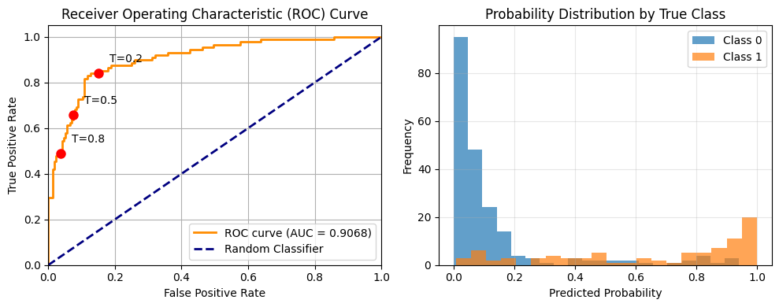

## 📈 Metrics Explained
1. ROC AUC (Receiver Operating Characteristic - Area Under Curve)
Purpose: Measures the model's ability to distinguish between classes across all possible classification thresholds.

Raison d'être: ROC AUC measures the model's ability to distinguish between classes across all possible classification thresholds. It shows the trade-off between True Positive Rate and False Positive Rate.



```
Interpretation:
1.0: Perfect classifier
0.9-1.0: Excellent
0.8-0.9: Good
0.7-0.8: Fair
0.5-0.7: Poor
0.5: Random guessing
<0.5: Worse than random

When to Use:
Balanced datasets

Overall model comparison

When both classes are equally important
```

2. Precision-Recall AUC

Purpose: Focuses on model performance for the positive class only, especially useful for imbalanced datasets.

Raison d'être: Better for imbalanced datasets where the positive class is rare. Focuses on the model's performance on the positive class only.

Precision measures **accuracy** of positive predictions. 

Recalls measures model's ability to identify all relevant positive cases. 


```
Interpretation:
Higher values indicate better performance on the positive class
More informative than ROC AUC when positive class is rare

When to Use:
Imbalanced datasets (e.g., 99% negative, 1% positive)

Fraud detection

Medical diagnosis

When false positives are costly
```

3. F1-Score
Purpose: Harmonic mean of **precision** and **recall**, providing a single metric that balances both.

Raison d'être: Harmonic mean of precision and recall. Useful when you need a single metric that balances both precision and recall. This is useful to consider both false +ve and false -ve to deter falsehoods.


```
Formula: F1 = 2 × (Precision × Recall) / (Precision + Recall)

Interpretation:
1.0: Perfect precision and recall
0.0: Worst possible score

> 0.9: Excellent
0.8 - 0.9: Very good
0.7 - 0.8: Good
0.6 - 0.7: Fair
< 0.6: Poor

When to Use:
Need balanced view of precision and recall

Class imbalance scenarios

When both false positives and false negatives matter
```

4. Precision
Purpose: Measures the accuracy of positive predictions.

```
Formula: Precision = True Positives / (True Positives + False Positives)

When to Use:
Spam detection

Medical testing

When false positives are expensive
```

5. Recall (Sensitivity)
Purpose: Measures the ability to find all positive instances.

```
Formula: Recall = True Positives / (True Positives + False Negatives)

When to Use:
Disease screening

Security threats

When false negatives are dangerous
```

6. Accuracy
Purpose: Overall correctness of the model.

```
Formula: Accuracy = (TP + TN) / (TP + TN + FP + FN)

When to Use:

Balanced datasets

Simple problems

When all error types are equally important
```


### 📊 Metric Selection Guide
```
Scenario	Recommended Metrics	Reason
Balanced Dataset	ROC AUC, Accuracy	Overall performance matters
Imbalanced Dataset	PR AUC, F1-Score	Focus on positive class
Fraud Detection	Precision, PR AUC	Minimize false positives
Medical Screening	Recall, F1-Score	Minimize false negatives
Model Comparison	ROC AUC, PR AUC	Comprehensive evaluation
```

```
When to Use Which Metric:
Metric	Raison d'être	Best Use Cases
ROC AUC	Overall class separation ability	Balanced datasets, comparing models
PR AUC	Positive class performance	Imbalanced datasets, fraud detection
F1-Score	Balance precision & recall	Classification with class imbalance
Precision	Avoid false positives	Spam detection, medical diagnosis
Recall	Find all positives	Disease screening, security
Accuracy	Overall correctness	Balanced datasets, simple problems
```

### 🎯 Best Practices
```
Start with ROC AUC for general model assessment

Use PR AUC for imbalanced datasets

Consider F1-Score when you need balance between precision and recall

Always plot curves (ROC and PR) for visual assessment

Select threshold based on business requirements

Use multiple metrics for comprehensive evaluation
```

---

## STATISTICAL TESTS SIMPLE GUIDE
---

1. T-TEST: Are the AVERAGES different?
   → Example: 'Does the new feature increase average revenue?'

   Result: p-value = 0.000000
   Old Feature: $99.2, New Feature: $109.7
   ✅ New feature significantly increases revenue!

2. CHI-SQUARE TEST: Did PREFERENCES change?
   → Example: 'After marketing, did product choices change?'

   Result: p-value = 0.382639
   ❌ No significant preference change
   (Small changes could be due to random variation)

3. KOLMOGOROV-SMIRNOV TEST: Did the PATTERN change?
   → Example: 'Did user behavior pattern change (not just average)?'

   Result: p-value = 0.000004
   KS Statistic: 0.1140
   ✅ User behavior pattern significantly changed!

4. MANN-WHITNEY U TEST: Is one group GENERALLY higher?
   → Example: 'Do premium users have higher engagement?'
/tmp/ipython-input-3644407060.py:172: MatplotlibDeprecationWarning: The 'labels' parameter of boxplot() has been renamed 'tick_labels' since Matplotlib 3.9; support for the old name will be dropped in 3.11.
  plt.boxplot([free_users, premium_users], labels=['Free Users', 'Premium Users'])

   Result: p-value = 0.003316
   Median - Free: 2.16, Premium: 2.55
   ✅ Premium users have significantly higher engagement!

5. KL DIVERGENCE: How SURPRISED would we be?
   → Example: 'How different is actual behavior from expected?'

   Result: KL Divergence = 0.020481
   ⚠️  Moderately surprised - noticeable differences

## UNDERSTANDING P-VALUES
--- 

P-VALUE GUIDE:
• p < 0.05: Statistically significant - unlikely due to chance
• p < 0.01: Highly significant - very unlikely due to chance  
• p < 0.001: Extremely significant - almost certainly not chance
• p > 0.05: Not significant - could be due to random variation

Remember: Statistical significance ≠ Practical importance!
A tiny difference can be 'significant' with large sample sizes.


### QUICK DECISION TREE
---

ASK YOURSELF:

1. Are you comparing CATEGORIES (like product choices)?
   → USE CHI-SQUARE TEST

2. Are you comparing NUMBERS?
   • "Are the AVERAGES different?" → T-TEST
   • "Is the overall PATTERN different?" → KOLMOGOROV-SMIRNOV  
   • "Is one group GENERALLY higher?" → MANN-WHITNEY U

3. Do you want to measure "how surprised" you'd be?
   → USE KL DIVERGENCE


### REAL-WORLD SCENARIOS
---

1. Did the new website design change how long people stay?
   👉 USE: KS TEST
   💡 Why: Looking at the entire pattern of user behavior

2. After our ad campaign, did product preferences shift?
   👉 USE: CHI-SQUARE TEST
   💡 Why: Comparing category frequencies

3. Does the new feature increase average revenue per user?
   👉 USE: T-TEST
   💡 Why: Comparing average values

4. Are customer satisfaction scores higher for paid users?
   👉 USE: MANN-WHITNEY U
   💡 Why: Scores are usually skewed, not normal

5. How different is current user behavior from our predictions?
   👉 USE: KL DIVERGENCE
   💡 Why: Measuring 'surprise' between expected vs actual

