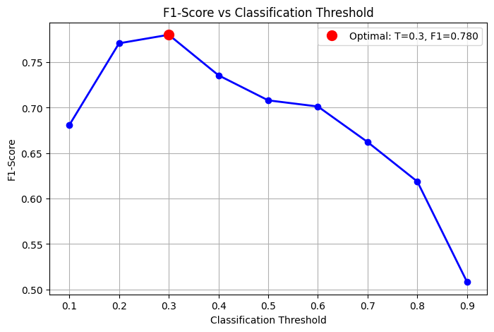

## 📈 Metrics Explained
1. ROC AUC (Receiver Operating Characteristic - Area Under Curve)
Purpose: Measures the model's ability to distinguish between classes across all possible classification thresholds.

Raison d'être: ROC AUC measures the model's ability to distinguish between classes across all possible classification thresholds. It shows the trade-off between True Positive Rate and False Positive Rate.


```
Interpretation:
1.0: Perfect classifier
0.9-1.0: Excellent
0.8-0.9: Good
0.7-0.8: Fair
0.5-0.7: Poor
0.5: Random guessing
<0.5: Worse than random

When to Use:
Balanced datasets

Overall model comparison

When both classes are equally important
```

2. Precision-Recall AUC

Purpose: Focuses on model performance for the positive class only, especially useful for imbalanced datasets.

Raison d'être: Better for imbalanced datasets where the positive class is rare. Focuses on the model's performance on the positive class only.


```
Interpretation:
Higher values indicate better performance on the positive class
More informative than ROC AUC when positive class is rare

When to Use:
Imbalanced datasets (e.g., 99% negative, 1% positive)

Fraud detection

Medical diagnosis

When false positives are costly
```

3. F1-Score
Purpose: Harmonic mean of precision and recall, providing a single metric that balances both.

Raison d'être: Harmonic mean of precision and recall. Useful when you need a single metric that balances both precision and recall.



```
Formula: F1 = 2 × (Precision × Recall) / (Precision + Recall)

Interpretation:
1.0: Perfect precision and recall
0.0: Worst possible score

> 0.9: Excellent
0.8 - 0.9: Very good
0.7 - 0.8: Good
0.6 - 0.7: Fair
< 0.6: Poor

When to Use:
Need balanced view of precision and recall

Class imbalance scenarios

When both false positives and false negatives matter
```

4. Precision
Purpose: Measures the accuracy of positive predictions.

```
Formula: Precision = True Positives / (True Positives + False Positives)

When to Use:
Spam detection

Medical testing

When false positives are expensive
```

5. Recall (Sensitivity)
Purpose: Measures the ability to find all positive instances.

```
Formula: Recall = True Positives / (True Positives + False Negatives)

When to Use:
Disease screening

Security threats

When false negatives are dangerous
```

6. Accuracy
Purpose: Overall correctness of the model.

```
Formula: Accuracy = (TP + TN) / (TP + TN + FP + FN)

When to Use:

Balanced datasets

Simple problems

When all error types are equally important
```


### 📊 Metric Selection Guide
```
Scenario	Recommended Metrics	Reason
Balanced Dataset	ROC AUC, Accuracy	Overall performance matters
Imbalanced Dataset	PR AUC, F1-Score	Focus on positive class
Fraud Detection	Precision, PR AUC	Minimize false positives
Medical Screening	Recall, F1-Score	Minimize false negatives
Model Comparison	ROC AUC, PR AUC	Comprehensive evaluation
```

```
When to Use Which Metric:
Metric	Raison d'être	Best Use Cases
ROC AUC	Overall class separation ability	Balanced datasets, comparing models
PR AUC	Positive class performance	Imbalanced datasets, fraud detection
F1-Score	Balance precision & recall	Classification with class imbalance
Precision	Avoid false positives	Spam detection, medical diagnosis
Recall	Find all positives	Disease screening, security
Accuracy	Overall correctness	Balanced datasets, simple problems
```

### 🎯 Best Practices
```
Start with ROC AUC for general model assessment

Use PR AUC for imbalanced datasets

Consider F1-Score when you need balance between precision and recall

Always plot curves (ROC and PR) for visual assessment

Select threshold based on business requirements

Use multiple metrics for comprehensive evaluation
```