# statistical_distribution_testing_cookbook

## KS Test: Detects any differences in continuous distributions (shape, location, spread)

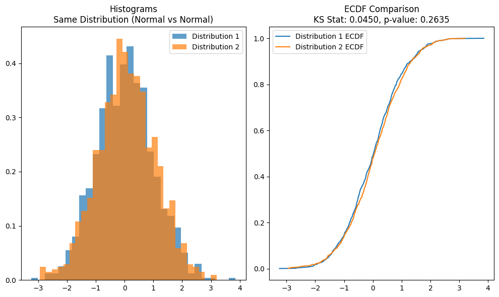

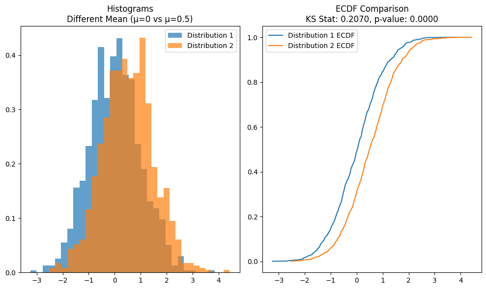

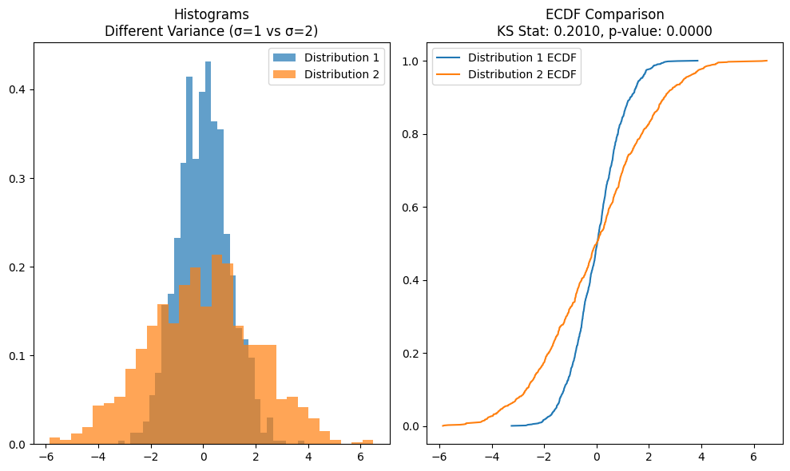

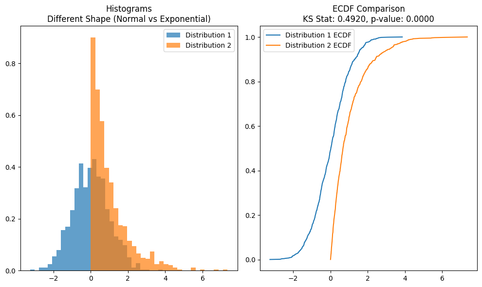

## Chi-square Test: Detects differences in categorical frequency distributions

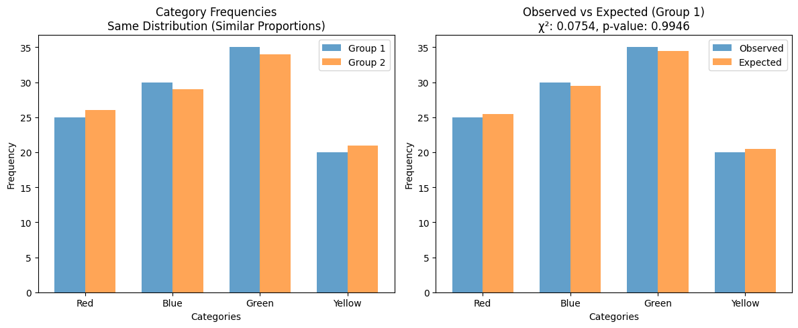

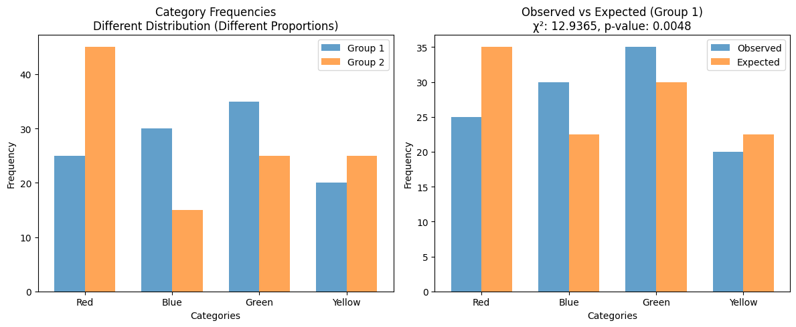

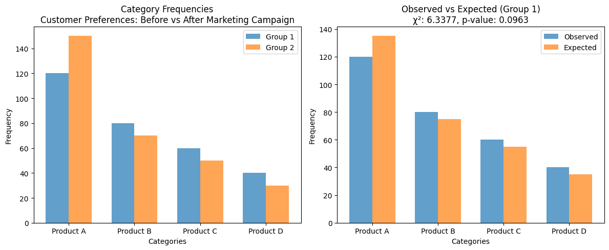

# Which Stats Test?

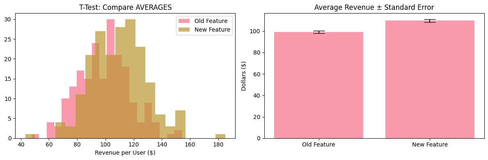

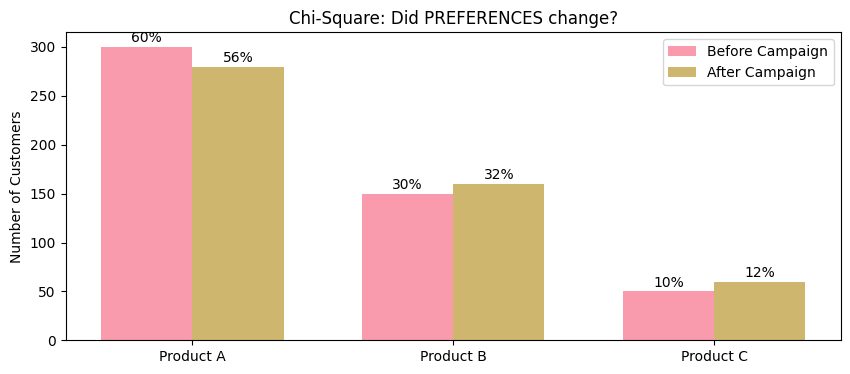

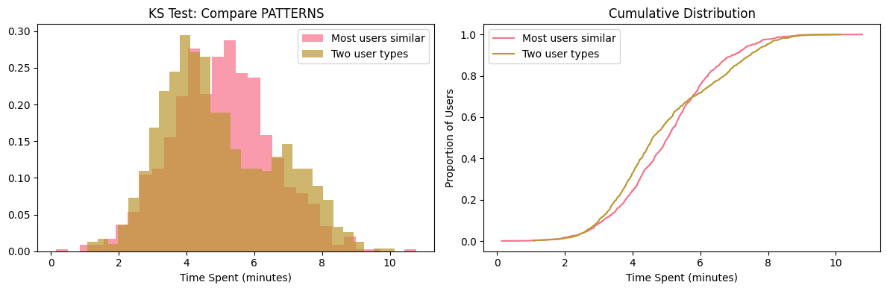

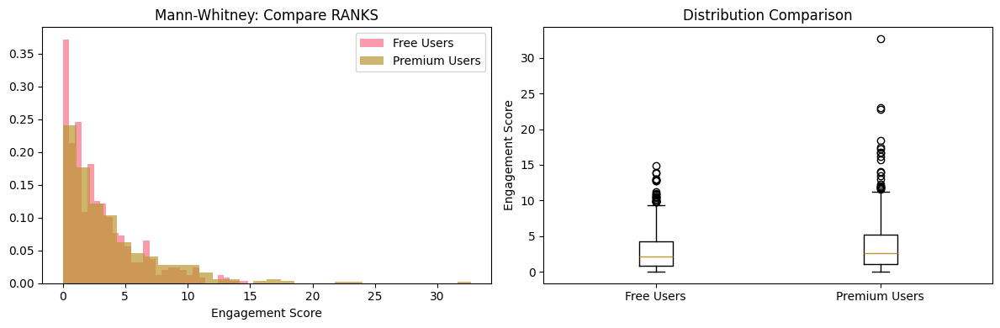

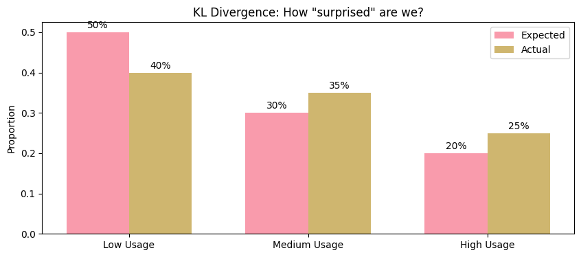


# diff_kl_js_divergence

```
Key Differences:
Symmetry: KL is asymmetric, JS is symmetric

Range: KL can be 0 to ∞, JS is always 0 to 1

Zero handling: KL breaks with zeros, JS handles them

Interpretation: KL = "surprise", JS = "average difference"

Simple Rule:
Use KL when you have "true" vs "predicted"

Use JS when comparing two distributions equally

Use JS when you need consistent, bounded results
```

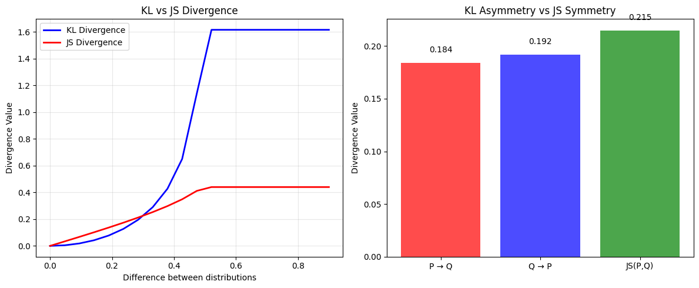

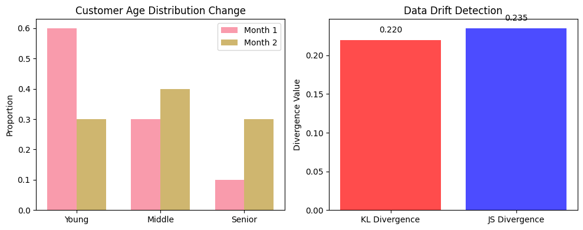

